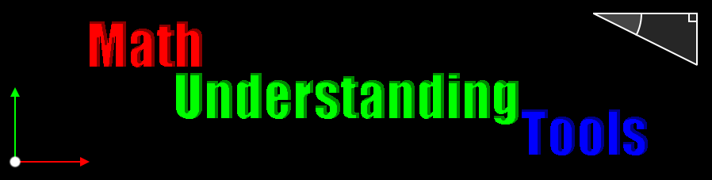

# Purpose of the project

math-understanding-tools has been developed to make demonstration about mathematics.  
The core project is based on [pixiJS](https://www.pixijs.com/).  
It allows to draw some vectors, basic shapes, line, grids, angle, measurement, coordinates (...)  
If you are seaching how to explain/represent/draw cos/sin, normalization, etc... to your student, friends, community, (...) you can use this library to simplify the development of your demonstration.

## Setup
### NPM Install
```
npm install math-understanding-tools
```

## Basic Usage Example
```ts
import { Application } from  "pixi.js";
import { GraphicVector, OVector2, UpdateService } from  "math-understanding-tools";

let options = {
    antialias:true,
    autoResize:true
};

const app    = new Application(options);
const vector = new GraphicVector(app.stage, new OVector2(), new OVector2(100, 50));

document.addEventListener("DOMContentLoaded", init);
window.addEventListener("resize", resize);

function init(_:Event):void {
    app.ticker.add(UpdateService.update);
    document.body.appendChild(app.view);
    resize();
}

function resize(_?:Event):void {
    app.renderer.resize(window.innerWidth, window.innerHeight);
}
```

### Advice (js module management nightmare)
To setup your development environment with the simpliest way, consider using [vitejs](https://vitejs.dev/guide/), [snowpack](https://www.snowpack.dev/tutorials/quick-start) or other solutions.

## Benefit of OClass
If you would like to animate your mathematic demo, you can use a tween lib.  
The targeted Graphic will schedule a draw in the next frame when a change has been detected.

Let's using [GSAP](https://greensock.com/get-started/) and change the init fonction in the previous code snippet:
```ts
// ...
import { gsap } from  "gsap";

// ...
function init(_:Event):void {
    app.ticker.add(UpdateService.update);
    document.body.appendChild(app.view);
    resize();

    let timeline:gsap.core.Timeline = gsap.timeline();
    timeline.to(vector.to, {x:200, y:400, duration:2, delay:1});
    timeline.to(vector.lineStyle, {alpha:0, duration:1});
    timeline.set(vector.lineStyle, {color:0xFF4444});
    timeline.to(vector.lineStyle, {alpha:1, duration:1});
    timeline.to(vector.from, {x:500, y:200, duration:1}, "-=1");
}
```
## MathMap
Global container helping to hierarchize drawings with a lot of method to add graphic things.

## Window
Internally using ORectTranform to make interface working for any screen size.

## Style
Each graphics has it own default style that you can grab from an instance or from the class.
```ts
// from class
GraphicShape.defaultFillStyle

// from instance
let shape:GraphicShape = new GraphicShape(/*aContainerInstance*/);
shape.defaultFillStyle;
```

The Style object returned by defaultFillStyleProperty is the same for all instance.  
  
If you wish that a particular instance has its own style, consider using following property:  
`shape.fillStyle`  
  
Note: internally, if the fillStyle (or lineStyle) property is not use, the graphic will use the defaultFillStyle.  
When you affect a value to fillStyle property or if you use directly the property, the used style becomes the fillStyle.  
If you desire after editing a fillStyle property to go back to defaultFillStyle to make your instance looks like the others, affect null or defaultFillStyle to fillStyle property.  
```ts
// I would like to shape has its own fill style, so, let's using fillStyle prop :
shape.fillStyle.color = 0xFF0000;

// oups, I would like to go back to default fill style :
shape.fillStyle = null;
// or
shape.fillStyle = shape.defaultFillStyle; // or GraphicShape.defaultFillStyle
```
Note: internally, the fillStyle is not initalized until you use it. If you do not affect your own value, it will be internally initialized with a copy of defaultFillStyle.

## Utils
A lot of basic mathematic stuff are here:  
OVector2 (Note: static methods will return a new instance while the instance methods will update the targeted instance)  
ORectangle  
MathTools  
UpdateService (for gameloop)  
ORectTransform (Same as Unity system)  
Feel free to explore and use them  
